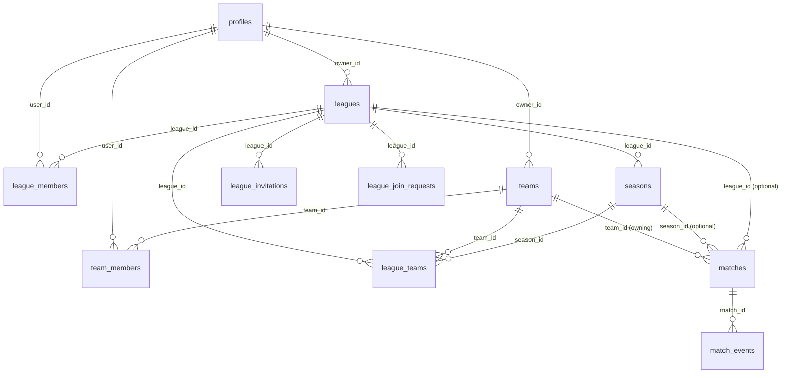

# PRD: Workspace-based Multi-Tenant RBAC for Leagues and Teams

> Status: Draft v1 — 2026-04-25
> Owner: Product / Architecture
> Source of truth for the migration from a team-centric model to a league-as-workspace, multi-tenant RBAC architecture.

---

## 0. Codebase Context Summary

The audit below is the snapshot of the current state used to ground every decision in this PRD.

### 0.1 Stack and conventions

- **Next.js 15** App Router with Server Components and Server Actions.
- **Supabase** (Postgres + Auth + Storage). All writes go through `SECURITY DEFINER` RPCs because `auth.uid()` inside PostgREST writes is unreliable in our setup.
- **Tailwind v4 + shadcn/ui**. Mobile-first.
- **Auth model**: username + password mapped to an internal email (`<username>@lapizarra.app`). The real email lives in `profiles.email` and is used for login-by-email and (eventually) recovery. There is no email confirmation flow today. Sign-up logic in `app/auth/actions.ts:6-94`.
- **Middleware** in `middleware.ts:1-57` only enforces *authenticated vs. public*. There is no per-route role/permission guard. Authorization lives in RPCs and RLS.

### 0.2 Current entity model (single-tenant by team)

| Entity | Source | Purpose |
| --- | --- | --- |
| `auth.users` | Supabase | Identity |
| `profiles` | `lapizarra_v2.sql:11-22` | Per-user data: `username`, `display_name`, `avatar_url`, `email`, `active_team_id` |
| `teams` | `Schema.md`, `join_requests.sql:7` | Team entity: `name`, `slug`, colors, `created_by`, `join_mode ∈ {open, request, invite_only}`, `deleted_at` |
| `team_members` | `Schema.md:126-149` | M:N user↔team with `role ∈ {admin, player}`, `status`, `jersey_number`, `position`. `user_id` is **nullable** to support **guest players** (`guest_name`). UNIQUE(team_id, user_id), UNIQUE(team_id, jersey_number). |
| `invitations` | `Schema.md:158-174` | Per-team invitation by `token` (link) or 6-char `code` |
| `join_requests` | `join_requests.sql:11-22` | Per-team request flow when `join_mode='request'` |
| `matches` | `Schema.md:198-217` + `lapizarra_v2.sql` | Per-team. `opponent_name` is free text, `competition_name` is free text. Has `is_home`, `type ∈ {friendly, league, cup, tournament}`, `status`, `goals_for/against`. |
| `match_events` | `Schema.md:249-267` | Per-team-per-match. `event_type ∈ {goal, assist, own_goal, opponent_goal, yellow_card, red_card}`. `player_id` nullable (rival events). |
| `match_attendance` | (referenced in `home/page.tsx`) | PK `(match_id, user_id)`, `status ∈ {confirmed, declined}`. |
| `manual_stat_adjustments` | `Schema.md:272-282` | Audit/correction of stats per team/player. |
| `team_charges`, `charge_distributions`, `payment_records` | `finance_module.sql` | Finance scoped to a team. |
| `training_sessions` | `training_sessions.sql` | Scoped to `user_id` with optional `team_id`. RLS: `auth.uid() = user_id`. |
| `venues` | `Schema.md:179-188` | `team_id` nullable (global predefined or team-custom). |
| Views | `team_stats`, `player_stats`, `team_finance_summary`, `player_pending_charges` | Computed reads. |
| RPCs | `set_active_team`, `get_user_teams`, `update_match`, `replace_match_events`, `create_match_with_events`, `create_team_for_user`, `set_match_attendance`, `get_public_directory`, … | Always `SECURITY DEFINER`. Authorization is hand-rolled inside each RPC via `team_members` lookup. |

### 0.3 Current authorization model

- **RLS helpers** (`docs/LaPizarra/03-Database/RLS-Policies.md`):
  - `is_team_member(team_id)` → boolean
  - `is_team_admin(team_id)` → boolean
- **Single role enum**: `team_role ∈ {admin, player}`. There is no editor/coach/manager differentiation.
- **Authorization patterns inside RPCs** (e.g., `lapizarra_v2.sql:158-166`, `relax_match_edit_permissions.sql:30-37`):
  - Some RPCs require `role='admin'`.
  - Some have been *relaxed* to require only `status='active'` (any member). This inconsistency is technical debt: **permission rules are scattered across SQL files**.
- **Active context**: `profiles.active_team_id`. The whole UI assumes a single active team and routes all data fetches through `getActiveTeamMembership()` (`lib/team.ts:43-89`). Selection lives at `/team-select`.

### 0.4 Current routes and surface

```
app/
  page.tsx                   → public landing
  auth/{login,signup}        → identifier+password auth
  onboarding/                → create-team | join-team | setup-player
  team-select/               → switch active team (multi-team users)
  home/                      → dashboard (active team)
  team/                      → squad + admin tab (join_mode, requests)
  matches/{,new,[id],[id]/edit} → match management (active team)
  finance/                   → charges and payments (active team)
  training/                  → personal training (feature-flagged)
  directory/                 → public-ish team directory
  profile/                   → user profile + settings entry
  players/[id]/              → player profile
  analytics/                 → team analytics
  join/[token]               → accept invitation
  api/payment/*              → Stripe + Fintoc webhooks
```

The mobile bottom nav (`components/mobile-nav.tsx:9-28`) hardcodes 5 tabs against the active team.

### 0.5 Identified technical debt and risks for this initiative

1. **Authorization is duplicated and inconsistent**: every write RPC re-implements its own `team_members` check. Roles `admin`/`player` are too coarse. `update_match` was relaxed to "any member" while `replace_match_events` lives in two files (`lapizarra_v2.sql` and `relax_match_edit_permissions.sql`) — the second overrides the first. There is no central permission registry.
2. **`team_role` enum is a hard limit**: it cannot represent coach, manager, captain, referee, league admin, etc. without an `ALTER TYPE` per role.
3. **Active context is a single column on `profiles`**: works for "active team" but cannot represent "active workspace + active team".
4. **`matches.team_id` is the home team only**: there is no concept of "match between team A and team B". `opponent_name` is free text. Implementing leagues requires two team references (or a join table for participants) and a season/league pointer.
5. **`teams.created_by` is the owner heuristic**: there is no formal "team owner" or "league owner" concept; the implicit rule is "the first admin".
6. **`profiles.active_team_id`** has no replacement when a user is in a league but has no team in that league.
7. **Public directory** (`get_public_directory`) is a SECURITY DEFINER bypassing RLS — fine, but will need league/season filters.
8. **Finance, training, attendance** all assume team scope. Some flows (e.g., league dues) will need league scope.
9. **Slug generator** (`onboarding/actions.ts:6-15`) appends a 4-char suffix — fine for teams but needs a new helper for leagues.
10. **Mobile nav** is fixed; switching context (team/league) currently requires a full route to `/team-select`.

### 0.6 What we do NOT need to refactor before this initiative

- Match events + score sync: already centralized in `replace_match_events` / `create_match_with_events`.
- Attendance: already isolated.
- Payments (Stripe/Fintoc): independent.
- Training: optional (feature flag).
- Directory: readable; just gets a league filter later.

---

## 1. Overview

### 1.1 Problem
Today **the team is the only tenant** in LaPizarra. A user can belong to several teams via `team_members`, and the UI uses `profiles.active_team_id` to scope every screen. There is no concept of a **league**, a **season**, or a **multi-team competition**. A team cannot participate in two competitions at once, and a user cannot hold different roles in different organisational contexts (e.g., *League Admin* in League A and *Player* in Team X that plays in League A).

This blocks three things the product needs next:

1. **Liga amateur** customers want to onboard as an organisation and run several seasons/cups across teams they don't own.
2. **Teams that play in multiple competitions** (e.g., one liga + one torneo + amistosos) need to track each independently without losing global stats.
3. **Differentiated roles** (manager, coach, captain, referee, treasurer) are required to delegate match registration, finance, and approvals.

### 1.2 Expected outcome
A workspace-based multi-tenant model where a **League is the workspace**, a **Team is global** and can participate in multiple leagues, and **users hold context-aware roles**. RBAC checks resolve through a single permission helper, not duplicated across RPCs. The UX gains a **context switcher** (workspace + optional team) and the auth/middleware gains a guarded server-side resolver. Existing teams keep working with zero league required.

### 1.3 Non-functional outcomes

- **No regressions** for amateur teams that never join a league. League is optional.
- **One single source of truth for permissions** — `lib/auth/permissions.ts` + Postgres helpers.
- **Migration is incremental**, no big bang. Each checkpoint is independently shippable.

---

## 2. Goals

### 2.1 Product goals
- Enable a league owner to run a workspace with multiple seasons, competitions, and participating teams.
- Allow a team to play in multiple leagues at the same time, with stats either global or scoped to a league/season.
- Give users **multiple roles in multiple contexts** (League A → admin, Team X → player, Team Y → coach).
- Add a clear **role hierarchy** that maps to product affordances (who can edit a match, who can confirm a payment, who can change join mode, etc.).

### 2.2 Technical goals
- Introduce **leagues** as a first-class tenant entity with `owner_id`, `slug`, branding, and settings.
- Introduce **league_members** (workspace memberships) and **league_teams** (M:N team↔league participation per season).
- Replace the binary `team_role` enum with a richer **role catalogue** stored in code + DB enum, and a single permission helper.
- Centralize permission checks: one `has_permission(user, permission, context)` SQL function + one TypeScript counterpart used by Server Actions, RPCs, and UI guards.
- Evolve the **active context** from `profiles.active_team_id` to `(active_league_id, active_team_id)`.
- Provide **RLS helpers** for league scope: `is_league_member(league_id)`, `is_league_admin(league_id)`, `is_league_team(team_id, league_id)`.
- Remain **backwards compatible** with team-only flows.

### 2.3 Success metrics
- A new league can be created and host two participating teams without any code change.
- Existing team flows (create match, register events, manage finance, attendance, training, directory) work unchanged for users not part of any league.
- A single user has a *League Admin* membership in League 1 and a *Player* membership in Team X with correct, distinct affordances on every screen.
- All write paths use the same permission helper. Zero hand-rolled `team_members` checks remain in new code.

---

## 3. Non-goals (V1)

- League standings / table calculation logic (totals, points, head-to-head). Stats remain *team-centric* in V1; leagues add a filter, not a new schema for points.
- Cross-team scheduling (assigning home/away with two `league_team` references in one match). V1 keeps `matches.team_id` as the *owning* team and adds optional `league_id` + `season_id` references.
- League billing / paid plans.
- Inviting league admins by email link (link generation reuses team invitation infra; email delivery is out of scope).
- Migrating `match_events`, `manual_stat_adjustments`, finance, or training to a league scope. They stay team-scoped.
- Breaking down `team_role='admin'` users into manager/coach. V1 introduces the **catalogue**; backfill maps existing admins to `team_manager` and existing players to `player`. UI surfaces for promoting to coach/captain ship in V1; existing admins are *not* downgraded.
- Public team directory cross-league filtering (filter by league is a small follow-up; not blocking).
- Platform Admin (super-admin) UI dashboard. Role exists in DB and gates risky cross-tenant operations, but no full admin console.
- Removing `profiles.active_team_id`. Kept for compatibility, augmented by `active_league_id`.
- Removing the `team_role` enum. Kept and extended; we add a richer catalogue alongside it (see §6.4).

---

## 4. User stories

### 4.1 League Owner — Diego
- *As a league owner, I want to create a league so that my workspace has its own settings, branding, and admins.*
- *As a league owner, I want to invite teams and assign their first manager so participating teams can self-administer.*
- *As a league owner, I want to designate league admins so I can delegate operations.*
- *As a league owner, I want to see every match, every team, and every payment that occurs inside my league.*

### 4.2 League Admin — Marcela
- *As a league admin, I want to start a season, schedule the calendar, and edit competition info on each match.*
- *As a league admin, I want to approve a team's request to participate in the league.*
- *As a league admin, I cannot see private team finance unless the team manager grants visibility.*

### 4.3 Team Manager — Andrés (today's `team admin`)
- *As a team manager, I want my team to participate in one or more leagues without losing my private team data.*
- *As a team manager, I want to register matches, set the squad, manage finance, and confirm payments.*
- *As a team manager, I want to promote a coach who can register matches but cannot edit finance.*

### 4.4 Coach — Pablo (new role)
- *As a coach, I want to register match events and call attendance, but I should not be able to edit team settings, manage join requests, or change finance.*

### 4.5 Player — Lucas (today's `team player`)
- *As a player, I want to confirm attendance, see my stats, and pay my dues.*
- *As a player, I cannot edit a match I didn't create unless promoted.*
- *As a player in two teams in two leagues, I want a switcher so I land in the right context.*

### 4.6 Guest / Viewer
- *As a guest, I can see the public directory and a league's public page (if league is public).*
- *As a guest, I cannot see private team finance, attendance, or member contact info.*

### 4.7 Platform Admin — Internal
- *As a platform admin, I can resolve corner cases (e.g., recover a league with no admin) without bypassing the audit trail.*

---

## 5. Roles and permissions

### 5.1 Role catalogue

Roles split into two scopes:

- **League-scoped** (`league_role`): `league_owner`, `league_admin`, `league_referee`, `league_viewer`.
- **Team-scoped** (`team_role` extended): `team_manager`, `coach`, `captain`, `player`, `team_viewer` (read-only, e.g., a parent).
- **Platform-scoped** (`platform_role`): `platform_admin`, `support`. Stored on `profiles.platform_role` (default `null`).

### 5.2 Permission matrix (V1)

Legend: ✅ allowed, 🟡 allowed if also team-manager/coach in same team, ❌ denied.

| Permission | Platform Admin | League Owner | League Admin | League Referee | Team Manager | Coach | Captain | Player | Viewer |
| --- | :-: | :-: | :-: | :-: | :-: | :-: | :-: | :-: | :-: |
| **League: create league** | ✅ | n/a | n/a | n/a | n/a | n/a | n/a | n/a | n/a |
| League: edit settings | ✅ | ✅ | ✅ | ❌ | ❌ | ❌ | ❌ | ❌ | ❌ |
| League: delete league | ✅ | ✅ | ❌ | ❌ | ❌ | ❌ | ❌ | ❌ | ❌ |
| League: invite admin | ✅ | ✅ | ✅ | ❌ | ❌ | ❌ | ❌ | ❌ | ❌ |
| League: invite team | ✅ | ✅ | ✅ | ❌ | ❌ | ❌ | ❌ | ❌ | ❌ |
| League: approve team participation | ✅ | ✅ | ✅ | ❌ | ❌ | ❌ | ❌ | ❌ | ❌ |
| League: create season | ✅ | ✅ | ✅ | ❌ | ❌ | ❌ | ❌ | ❌ | ❌ |
| League: read all matches in league | ✅ | ✅ | ✅ | ✅ | 🟡 | 🟡 | 🟡 | 🟡 | 🟡 |
| **Team: create team** | ✅ | (any user) | (any user) | (any user) | (any user) | (any user) | (any user) | (any user) | (any user) |
| Team: edit settings | ✅ | ❌ | ❌ | ❌ | ✅ | ❌ | ❌ | ❌ | ❌ |
| Team: delete team | ✅ | ❌ | ❌ | ❌ | ✅ | ❌ | ❌ | ❌ | ❌ |
| Team: change join_mode | ✅ | ❌ | ❌ | ❌ | ✅ | ❌ | ❌ | ❌ | ❌ |
| Team: invite member / generate code | ✅ | ❌ | ❌ | ❌ | ✅ | ✅ | ❌ | ❌ | ❌ |
| Team: review join requests | ✅ | ❌ | ❌ | ❌ | ✅ | ✅ | ❌ | ❌ | ❌ |
| Team: promote/demote member | ✅ | ❌ | ❌ | ❌ | ✅ | ❌ | ❌ | ❌ | ❌ |
| Team: assign jersey/position | ✅ | ❌ | ❌ | ❌ | ✅ | ✅ | ❌ | ❌ | ❌ |
| Team: join a league (request participation) | ✅ | ❌ | ❌ | ❌ | ✅ | ❌ | ❌ | ❌ | ❌ |
| **Match: create** | ✅ | ✅ (in league) | ✅ (in league) | ❌ | ✅ | ✅ | ❌ | ❌ | ❌ |
| Match: edit metadata | ✅ | ✅ (in league) | ✅ (in league) | ✅ (in league) | ✅ | ✅ | ❌ | ❌ | ❌ |
| Match: register/replace events | ✅ | ❌ | ❌ | ✅ (in league) | ✅ | ✅ | ✅ | ❌ | ❌ |
| Match: delete (soft) | ✅ | ✅ (in league) | ✅ (in league) | ❌ | ✅ | ❌ | ❌ | ❌ | ❌ |
| **Attendance: confirm own** | ✅ | ✅ | ✅ | ✅ | ✅ | ✅ | ✅ | ✅ | ❌ |
| Attendance: set someone else's | ✅ | ❌ | ❌ | ❌ | ✅ | ✅ | ❌ | ❌ | ❌ |
| **Finance: view own** | ✅ | ❌ | ❌ | ❌ | ✅ | ✅ | ✅ | ✅ | ❌ |
| Finance: view team aggregate | ✅ | ❌ | ❌ | ❌ | ✅ | ✅ | ❌ | ❌ | ❌ |
| Finance: create charge | ✅ | ❌ | ❌ | ❌ | ✅ | ❌ | ❌ | ❌ | ❌ |
| Finance: confirm payment | ✅ | ❌ | ❌ | ❌ | ✅ | ❌ | ❌ | ❌ | ❌ |
| **Stats: read team** | ✅ | ✅ (in league) | ✅ (in league) | ✅ (in league) | ✅ | ✅ | ✅ | ✅ | ✅ |
| Stats: manual adjustment | ✅ | ❌ | ❌ | ❌ | ✅ | ❌ | ❌ | ❌ | ❌ |

Notes:
- "🟡 in league" means: allowed because the user is a team member of a team that participates in that league.
- "Captain" exists primarily as a label and only adds: register match events. Otherwise behaves like player.
- League-scoped roles see league data but **do not bypass team finance/attendance** unless they are also a team manager.

### 5.3 Permission helper API

```ts
// lib/auth/permissions.ts
export type Permission =
  | 'league.edit'
  | 'league.invite_admin'
  | 'league.invite_team'
  | 'league.create_season'
  | 'league.read'
  | 'team.edit'
  | 'team.invite'
  | 'team.review_requests'
  | 'team.promote_member'
  | 'team.join_league'
  | 'match.create'
  | 'match.edit'
  | 'match.register_events'
  | 'match.delete'
  | 'attendance.set_other'
  | 'finance.create_charge'
  | 'finance.confirm_payment'
  | 'finance.view_aggregate'
  | 'stats.adjust'

export type PermissionContext = {
  leagueId?: string
  teamId?: string
  matchId?: string
}

export async function hasPermission(
  supabase: SupabaseClient,
  permission: Permission,
  context: PermissionContext
): Promise<boolean>

export async function requirePermission(/* … */): Promise<void>  // throws if denied
```

The TS helper calls a single Postgres function `public.has_permission(p_user uuid, p_permission text, p_league uuid, p_team uuid, p_match uuid)` that consolidates the rules above. RLS keeps its own existing helpers for hot paths.

---

## 6. Data model proposal

The proposal is **additive** to the current schema. Existing tables stay; new tables and a few nullable FKs are added. Naming follows the current style (`snake_case`, `*_id`, soft-delete via `deleted_at`).

### 6.1 New entities

```sql
-- 6.1.1 Leagues (the workspace / tenant)
create table public.leagues (
    id              uuid primary key default uuid_generate_v4(),
    name            text not null,
    slug            text unique not null,
    description     text,
    logo_url        text,
    primary_color   text default '#16a34a',
    secondary_color text default '#ffffff',
    visibility      text not null default 'private'
                    check (visibility in ('public','unlisted','private')),
    join_mode       text not null default 'invite_only'
                    check (join_mode in ('open','request','invite_only')),
    owner_id        uuid not null references public.profiles(id),
    deleted_at      timestamptz,
    created_at      timestamptz not null default now(),
    updated_at      timestamptz not null default now()
);

-- 6.1.2 League memberships (workspace-level roles)
create type public.league_role as enum
  ('league_owner','league_admin','league_referee','league_viewer');

create table public.league_members (
    id          uuid primary key default uuid_generate_v4(),
    league_id   uuid not null references public.leagues(id) on delete cascade,
    user_id     uuid not null references public.profiles(id) on delete cascade,
    role        public.league_role not null default 'league_admin',
    status      public.member_status not null default 'active',
    invited_by  uuid references public.profiles(id),
    joined_at   timestamptz not null default now(),
    created_at  timestamptz not null default now(),
    updated_at  timestamptz not null default now(),
    unique(league_id, user_id)
);

-- 6.1.3 Team participation in a league (M:N + per-season)
create table public.league_teams (
    id              uuid primary key default uuid_generate_v4(),
    league_id       uuid not null references public.leagues(id) on delete cascade,
    team_id         uuid not null references public.teams(id) on delete cascade,
    season_id       uuid references public.seasons(id) on delete set null,
    status          text not null default 'active'
                    check (status in ('pending','active','withdrawn','rejected')),
    requested_by    uuid references public.profiles(id),
    approved_by     uuid references public.profiles(id),
    joined_at       timestamptz not null default now(),
    created_at      timestamptz not null default now(),
    updated_at      timestamptz not null default now(),
    unique(league_id, team_id, season_id)  -- a team can rejoin per season
);

-- 6.1.4 Seasons (the lightweight "project" unit)
create table public.seasons (
    id          uuid primary key default uuid_generate_v4(),
    league_id   uuid not null references public.leagues(id) on delete cascade,
    name        text not null,                    -- "Apertura 2026"
    starts_on   date,
    ends_on     date,
    is_current  boolean not null default false,
    created_at  timestamptz not null default now(),
    updated_at  timestamptz not null default now()
);
create unique index seasons_one_current_per_league
  on public.seasons(league_id) where is_current;

-- 6.1.5 League invitations (mirror of team `invitations`)
create table public.league_invitations (
    id          uuid primary key default uuid_generate_v4(),
    league_id   uuid not null references public.leagues(id) on delete cascade,
    created_by  uuid not null references public.profiles(id),
    role        public.league_role not null default 'league_admin',
    type        public.invitation_type not null,        -- enum reused
    token       text unique not null,
    code        text unique,
    status      public.invitation_status not null default 'pending',
    used_by     uuid references public.profiles(id),
    expires_at  timestamptz not null default (now() + interval '7 days'),
    used_at     timestamptz,
    created_at  timestamptz not null default now()
);

-- 6.1.6 Optional: explicit team-→-league participation requests (parallel to join_requests)
create table public.league_join_requests (
    id          uuid primary key default uuid_generate_v4(),
    league_id   uuid not null references public.leagues(id),
    team_id     uuid not null references public.teams(id),
    requested_by uuid not null references public.profiles(id),
    status      text not null default 'pending'
                check (status in ('pending','approved','rejected')),
    reviewed_by uuid references public.profiles(id),
    reviewed_at timestamptz,
    created_at  timestamptz not null default now(),
    updated_at  timestamptz not null default now(),
    unique(league_id, team_id)
);
```

### 6.2 Modified entities (additive)

```sql
-- profiles: add platform role + active workspace
alter table public.profiles
  add column platform_role text
    check (platform_role in ('platform_admin','support')),
  add column active_league_id uuid references public.leagues(id) on delete set null;

-- matches: optional league/season scope
alter table public.matches
  add column league_id uuid references public.leagues(id) on delete set null,
  add column season_id uuid references public.seasons(id) on delete set null;

create index idx_matches_league_id on public.matches(league_id);
create index idx_matches_season_id on public.matches(season_id);

-- teams: track owner explicitly (today implicit via created_by)
alter table public.teams
  add column owner_id uuid references public.profiles(id);
update public.teams set owner_id = created_by where owner_id is null;

-- team_members: extend role catalogue
alter type public.team_role add value if not exists 'team_manager';   -- alias of admin
alter type public.team_role add value if not exists 'coach';
alter type public.team_role add value if not exists 'captain';
alter type public.team_role add value if not exists 'team_viewer';
-- Existing 'admin' rows are read as team_manager via a SQL function get_effective_role().
```

> **Naming note**: the old `admin` value of `team_role` stays for backward compatibility; new code reads `team_manager`. A view `effective_team_members` exposes the canonical role. Migration backfills no rows by default; a follow-up migration can convert `admin → team_manager` once all callers are updated.

### 6.3 Many-to-many summary

```
profiles ──< league_members >── leagues
profiles ──< team_members   >── teams
teams    ──< league_teams   >── leagues
seasons  ──< league_teams (per season participation)
matches  ──> teams (owning team) ──> league_teams (denormalised: league_id, season_id on match)
```

### 6.4 Ownership and tenant isolation rules

1. A **league** is owned by exactly one user (`owner_id`). The owner row in `league_members` must always exist with `role='league_owner'`. The last `league_owner` cannot be removed (validated in RPC).
2. A **team** is owned by exactly one user (`owner_id`). Last `team_manager` cannot be removed.
3. **League data** (seasons, league_teams, league_invitations, league_join_requests) is visible to active league members; `visibility='public'` exposes a read-only summary via a SECURITY DEFINER view (`get_public_league_summary`).
4. **Team data** (members, finance, attendance, training) is visible to active team members. League admins do NOT automatically see private team data.
5. **Match data** is visible to:
   - active members of the owning team, AND
   - active members of `matches.league_id` (if set).
6. **Cross-league leakage prevention**: every read RPC that takes `(league_id, team_id)` must verify the `league_teams` link is `active`.

### 6.5 New RLS helpers

```sql
create or replace function public.is_league_member(p_league uuid)
returns boolean language sql security definer stable as $$
  select exists (
    select 1 from public.league_members
    where league_id = p_league
      and user_id   = auth.uid()
      and status    = 'active'
  );
$$;

create or replace function public.is_league_admin(p_league uuid)
returns boolean language sql security definer stable as $$
  select exists (
    select 1 from public.league_members
    where league_id = p_league
      and user_id   = auth.uid()
      and role      in ('league_owner','league_admin')
      and status    = 'active'
  );
$$;

create or replace function public.is_team_in_league(p_team uuid, p_league uuid)
returns boolean language sql security definer stable as $$
  select exists (
    select 1 from public.league_teams
    where league_id = p_league
      and team_id   = p_team
      and status    = 'active'
  );
$$;
```

### 6.6 Permission resolver (Postgres)

```sql
create or replace function public.has_permission(
  p_user        uuid,
  p_permission  text,
  p_league      uuid default null,
  p_team        uuid default null,
  p_match       uuid default null
) returns boolean language plpgsql security definer stable as $$
declare
  v_platform   text;
  v_league_role public.league_role;
  v_team_role  public.team_role;
begin
  select platform_role into v_platform from public.profiles where id = p_user;
  if v_platform = 'platform_admin' then return true; end if;

  if p_league is not null then
    select role into v_league_role from public.league_members
      where league_id = p_league and user_id = p_user and status='active';
  end if;

  if p_team is not null then
    select role into v_team_role from public.team_members
      where team_id = p_team and user_id = p_user and status='active';
  end if;

  -- Switch through permissions; example excerpt:
  return case p_permission
    when 'league.edit'              then v_league_role in ('league_owner','league_admin')
    when 'league.invite_admin'      then v_league_role in ('league_owner','league_admin')
    when 'team.edit'                then v_team_role in ('team_manager','admin')
    when 'team.invite'              then v_team_role in ('team_manager','admin','coach')
    when 'match.create'             then v_team_role in ('team_manager','admin','coach')
                                       or v_league_role in ('league_owner','league_admin')
    when 'match.register_events'    then v_team_role in ('team_manager','admin','coach','captain')
                                       or v_league_role = 'league_referee'
    when 'finance.create_charge'    then v_team_role in ('team_manager','admin')
    when 'finance.confirm_payment'  then v_team_role in ('team_manager','admin')
    -- … see permission matrix
    else false
  end;
end $$;
```

This function is the **single source of truth**. `lib/auth/permissions.ts` calls it via `supabase.rpc('has_permission', …)`.

---

## 7. Auth and authorization flow

### 7.1 Login flow (unchanged identity layer)
Username + password ⇒ internal `<username>@lapizarra.app` ⇒ Supabase session. Real email is collected at signup and stored on `profiles.email` for recovery.

### 7.2 Post-login resolver
After `getUser()`, a server helper `resolveActiveContext(supabase, userId)` returns:

```ts
type ActiveContext = {
  user: User
  profile: Profile
  activeLeague: League | null   // nullable: a user can have no league
  activeTeam:   Team   | null   // nullable: a league member without a team
  leagueRole:   LeagueRole | null
  teamRole:     TeamRole   | null
}
```

Resolution order:
1. Read `profiles.active_league_id` and `profiles.active_team_id`.
2. If `active_team_id` belongs to a team that is no longer active → invalidate.
3. If user has 0 leagues and 0 teams → `/onboarding`.
4. If user has ≥ 1 league or team but no active ones → `/context-select` (the renamed `/team-select`).
5. Otherwise return the resolved context.

### 7.3 Middleware
`middleware.ts` continues to enforce only "authenticated vs. public". Per-page authorization moves to a Server Component helper `requireAuthorizedContext({ minLeagueRole?, minTeamRole?, permission? })` so we **do not run RPCs in the edge middleware**.

### 7.4 Server-side guards (Server Actions / RPCs)

```ts
// every server action starts with:
const ctx = await requireAuthorizedContext({ permission: 'match.create' })
// throws + redirects to /403 on denial
```

Behind the scenes this calls `public.has_permission(...)`. RPCs can additionally call the helper inline.

### 7.5 Frontend route protection
Server components call `requireAuthorizedContext`. UI affordances (buttons, tabs) are shown/hidden based on a **prefetched permissions map** for the current context, exposed as a `<PermissionsProvider>` to client components.

### 7.6 API authorization strategy (REST/RPC)
- All writes are SECURITY DEFINER RPCs that **must** call `has_permission` before mutating.
- Read RLS continues to use the lightweight `is_team_member` / `is_league_member` helpers for performance.
- The Stripe/Fintoc webhook routes already authenticate via signature; they get a `team_id` lookup via DB constraints, no league logic in V1.

---

## 8. UX flow

### 8.1 Workspace switcher (replaces `/team-select`)
- New route `/context-select` with two stacked sections:
  1. **Tus ligas** — list of `league_members` (badge for role).
  2. **Tus equipos** — list of `team_members` (badge for role + jersey).
- Tapping a league sets `active_league_id`, clears `active_team_id` and routes to the league dashboard.
- Tapping a team sets `active_team_id`, sets `active_league_id` only if the team has exactly one active league; otherwise the user picks a league or chooses "sin liga".
- Header chip on `/home`, `/team`, `/matches`, `/finance` shows the active context with a chevron to swap.

### 8.2 League creation
- New flow `/onboarding/create-league` (mirroring `create-team`):
  - Step 1: name, logo, slug.
  - Step 2: colors, visibility.
  - On submit → user becomes `league_owner` + `league_member` and `active_league_id` is set.
  - First-run modal: "¿Quieres invitar tus equipos?" → goes to invite-team flow.

### 8.3 Team creation (mostly unchanged)
- `/onboarding/create-team` keeps its current 2-step flow.
- A new optional step 3: "Unir a una liga" — shows the leagues the user is a member of and creates a `league_join_requests` (or directly an `active` `league_teams` row if user is `league_admin`).

### 8.4 Invite users (3 flows)
- **Invite to league**: from `/league/[slug]/admin` → generate link/code (mirror of `invitations` table).
- **Invite to team**: existing flow, unchanged.
- **Invite a team to participate in league**: new screen `/league/[slug]/teams/invite` — list of teams the inviter manages, plus a public-search field by team slug.

### 8.5 Assign roles
- **League admin tab** (`/league/[slug]/members`): table with `role` dropdown.
- **Team admin tab** (`/team` admin tab): role dropdown extended to `team_manager / coach / captain / player / team_viewer`.

### 8.6 Player onboarding (unchanged; copy adjusted)
- After joining a team, `/onboarding/setup-player` collects `position` + `jersey_number` per team. New copy mentions "podés jugar en varios equipos y ligas".

### 8.7 Team joining / request flow
- Same `join_mode` triad applied to leagues.
- A team's request to a league shows up in `/league/[slug]/admin` → "Solicitudes" tab.

### 8.8 Empty states
- **No league, no team** → `/onboarding`.
- **League with no team** → empty state: "Tu liga está vacía. Invita un equipo o crea uno."
- **Team in league with no matches** → existing `ZonaCero` state, plus "Crear partido de liga" CTA.

### 8.9 Error states
- **403** → `/403` page with: "Tu rol actual (Coach) no permite editar finanzas. Cambia de contexto o pide permisos al manager."
- Forbidden actions are **hidden** in the UI when the permission map says `false`; they only reach a 403 page if the user types the URL.

---

## 9. Migration strategy

### 9.1 Principles
- **Additive**, then **gradual**. No destructive `DROP` until all callers are migrated.
- Each migration is **idempotent** and **reversible** (down script in same file or in `*.down.sql`).
- Existing teams keep working with `league_id = NULL`.

### 9.2 Required migrations (in order)

1. `2026XXXX01_leagues_core.sql` — create `leagues`, `league_role` enum, `league_members`, `league_invitations`, `league_join_requests`.
2. `2026XXXX02_seasons_and_league_teams.sql` — create `seasons`, `league_teams`.
3. `2026XXXX03_extend_team_role_and_owner.sql` — add new enum values, `teams.owner_id`, `profiles.platform_role`, `profiles.active_league_id`.
4. `2026XXXX04_matches_league_season.sql` — add nullable `matches.league_id`, `matches.season_id`.
5. `2026XXXX05_rls_helpers_and_permissions.sql` — create `is_league_*`, `is_team_in_league`, `has_permission`, plus RLS policies on new tables.
6. `2026XXXX06_rpcs_league_management.sql` — `create_league_for_user`, `set_active_league`, `invite_league_admin`, `invite_team_to_league`, `approve_team_in_league`, `set_active_context`.
7. `2026XXXX07_match_create_with_league.sql` — extend `create_match_with_events`, `update_match` to accept optional `p_league_id`, `p_season_id`, with permission resolved through `has_permission`.
8. *(later)* `2026XXXX08_drop_admin_alias.sql` — when no callers reference `team_role='admin'`, alias to `team_manager` everywhere.

### 9.3 Backfill strategy

- `teams.owner_id ← teams.created_by` (already in §6.2).
- For each existing `team_members.role='admin'` row: leave as-is; reads use `effective_team_members` view to map to `team_manager`. Optional later migration converts.
- No automatic league creation. Existing teams remain *league-less*. An onboarding banner suggests "Crear o unirse a una liga".
- `profiles.active_league_id` defaults to `NULL`. `active_team_id` is preserved.

### 9.4 Default role assignment

- `create_league_for_user` always inserts a `league_members` row `(role='league_owner', status='active')`.
- `create_team_for_user` continues to insert `team_members(role='admin', status='active')`. New code reads this as `team_manager`.

### 9.5 Rollback plan

- Each migration ships a paired `down.sql` (or in-file `-- ROLLBACK` block):
  - `drop table league_members, league_invitations, league_join_requests, league_teams, seasons, leagues;`
  - `alter table matches drop column league_id, drop column season_id;`
  - `alter table profiles drop column active_league_id, drop column platform_role;`
  - `alter table teams drop column owner_id;`
- The new RPCs are independent; dropping them does not affect existing flows.
- `team_role` enum values are append-only in Postgres; rolling back the enum is not supported. Mitigation: never deploy code that depends on the new values until backfill is verified, and gate via feature flag (`NEXT_PUBLIC_FEATURE_LEAGUES`).

### 9.6 Feature flag

- `NEXT_PUBLIC_FEATURE_LEAGUES=true|false` in `lib/features.ts` toggles:
  - the **league** routes and the league section in the workspace switcher;
  - the league fields on the match form;
  - the new role dropdown on the team admin tab.
- Flag default `false` until checkpoint 7 is shipped.

---

## 10. API impact

### 10.1 New RPCs

| RPC | Purpose | Permission |
| --- | --- | --- |
| `create_league_for_user(p_name, p_slug, p_visibility, p_logo, p_colors)` | Insert league + owner membership | authenticated |
| `set_active_league(p_league_id)` | Update `profiles.active_league_id` | `is_league_member` |
| `set_active_context(p_league_id, p_team_id)` | Atomic update of both | membership + `is_team_in_league` if both set |
| `invite_to_league(p_league, p_role, p_type)` | Generate token/code | `league.invite_admin` |
| `invite_team_to_league(p_league, p_team, p_season)` | Insert `league_teams` `pending` | `league.invite_team` |
| `request_team_in_league(p_league, p_team, p_season)` | Insert `league_join_requests` | `team.join_league` |
| `approve_team_in_league(p_request_id)` | Promote request → `league_teams` active | `league.invite_team` |
| `get_user_contexts()` | Returns leagues + teams for switcher | authenticated |
| `get_league_dashboard(p_league)` | League home page payload | `is_league_member` |
| `has_permission(p_permission, …)` | Single permission resolver | authenticated |

### 10.2 Updated RPCs

| RPC | Change |
| --- | --- |
| `create_match_with_events` | Accepts optional `p_league_id`, `p_season_id`. Replaces hand-rolled admin check with `has_permission('match.create', league, team)`. |
| `update_match` | Same permission switch + sets `league_id` / `season_id`. |
| `replace_match_events` | Permission switch (`match.register_events`). |
| `set_match_attendance` | Permission switch for self vs. other. |
| `set_active_team` | Wrapped by `set_active_context`. |
| `get_user_teams` | Stays; `get_user_contexts` is new. |
| `get_public_directory` | Optional `p_league_id` filter. |

### 10.3 Deprecated (not removed in V1)
- Direct UPDATEs to `team_members.role` from server actions: must move through new `update_team_member_role` RPC.
- Direct INSERTs to `team_members` from `approveJoinRequest` (`app/team/actions.ts:31`): move into a `approve_team_join_request` RPC for symmetry with leagues and to centralize permission.

### 10.4 Permission checks per endpoint (samples)

| Endpoint / Action | Permission required |
| --- | --- |
| `POST /matches/new` (server action) | `match.create` with `(team_id, league_id?)` |
| `POST /matches/[id]/edit` | `match.edit` |
| `POST /matches/[id]/edit` events | `match.register_events` |
| `POST /finance/new` | `finance.create_charge` |
| `POST /finance/[chargeId]/manage` | `finance.confirm_payment` |
| `POST /team` join_mode update | `team.edit` |
| `POST /team` approve request | `team.review_requests` |
| `POST /league/[slug]/admin/*` | `league.edit` / `league.invite_admin` / etc. |
| `GET  /api/payment/*` (webhooks) | signature only; resolves team via FK |

---

## 11. Frontend impact

### 11.1 New routes / files

```
app/leagues/                             # list of user leagues (or redirect to /league/[slug])
app/league/
  [slug]/
    page.tsx                             # league dashboard (seasons, teams, schedule)
    members/
      page.tsx                           # invite + role table
      actions.ts
    teams/
      page.tsx                           # participating teams
      invite/
        page.tsx                         # invite team
    seasons/
      page.tsx
      [seasonId]/page.tsx
    settings/
      page.tsx                           # name, slug, branding, visibility, join_mode
app/onboarding/create-league/
  page.tsx
  create-league-form.tsx
  actions.ts
app/context-select/                      # rename of team-select
  page.tsx
  actions.ts
app/403/page.tsx                         # forbidden state
```

### 11.2 Updated files

| File | Change |
| --- | --- |
| `middleware.ts` | No-op change; document that authorization is downstream. |
| `lib/team.ts` | Re-exports kept for compat; new `lib/context.ts` exports `resolveActiveContext`. |
| `lib/auth/permissions.ts` | New: `hasPermission`, `requirePermission`, `usePermissions` client hook. |
| `lib/supabase/server.ts` / `client.ts` | Unchanged. |
| `app/team-select/*` | Becomes a redirect to `/context-select`. |
| `app/onboarding/page.tsx` | Adds a third option "Crear liga". |
| `app/onboarding/actions.ts` | `createTeam` adds optional `league_id` param. |
| `app/team/team-view.tsx` | Role dropdown extended; "Liga" badge on header when team plays in one. |
| `app/team/actions.ts` | All updates go through new RPCs (`update_team_join_mode`, `approve_team_join_request`). |
| `app/matches/new/new-match-form.tsx` | New "Liga" / "Temporada" selector when team has active leagues. |
| `app/matches/new/actions.ts` | Pass `league_id`, `season_id` to RPC. |
| `app/matches/[id]/page.tsx` | Render league + season chips; permission gate the edit affordances. |
| `app/home/page.tsx` | Header switcher updated; "Próximo partido de liga" widget when applicable. |
| `app/profile/page.tsx` | Lists league memberships; signout button stays. |
| `app/directory/directory-view.tsx` | Optional league filter. |
| `components/mobile-nav.tsx` | Conditional tab: replace "Equipo" with "Liga" when active context is a league with no team. |
| `components/app-shell.tsx` | Mounts a `<PermissionsProvider>` for the active context. |

### 11.3 New components

- `components/context-switcher.tsx` — header chip that opens the bottom sheet to swap context.
- `components/role-badge.tsx` — pill rendering (League Admin / Manager / Coach / Captain / Player).
- `components/permission-gate.tsx` — `<PermissionGate permission="match.edit">…</PermissionGate>` wrapper used to hide buttons.

---

## 12. Checkpoints / milestones

Each checkpoint is independently shippable. Acceptance criteria are testable end-to-end.

### Checkpoint 1 — Codebase audit and current model mapping
- **Objective**: lock the audit (this PRD §0) and produce an ER diagram of current + target state.
- **Tasks**:
  - Generate target ER diagram (mermaid) and link from `docs/LaPizarra/02-Architecture/`.
  - Write decision record `docs/LaPizarra/08-Decisions/ADR-004-Multi-Tenant-Leagues.md`.
  - Catalogue all current RPCs and their authorization rules in a single table.
- **Files affected**: `docs/LaPizarra/**`, this PRD.
- **Acceptance**: PRD reviewed and approved by product + tech.
- **Risks**: scope creep into season-aware standings — explicitly excluded by §3.

### Checkpoint 2 — Data model and migration plan
- **Objective**: ship migrations 01–05 (§9.2). No app code consumes them yet.
- **Tasks**:
  - Author and run migrations 01–05 against a Supabase preview branch.
  - Write `lib/auth/permissions.ts` thin wrapper that calls `has_permission`.
  - Generate updated TypeScript types via Supabase CLI.
- **Files affected**: `supabase/migrations/2026XXXX0[1-5]_*.sql`, `lib/auth/permissions.ts`, `lib/supabase/database.types.ts`.
- **Acceptance**:
  - All new tables exist; RLS enabled.
  - `select public.has_permission(uuid, 'match.create', null, '<team>', null)` returns `true` for current admins.
  - Existing flows still pass (regression suite, see §13).
- **Risks**: enum changes are append-only; migration must be idempotent. Mitigate with `add value if not exists`.

### Checkpoint 3 — Auth context and workspace selection
- **Objective**: introduce `resolveActiveContext` and the `/context-select` route. Existing `/team-select` redirects to it.
- **Tasks**:
  - Add `profiles.active_league_id` column (already in CP2) and the `set_active_context` RPC.
  - Implement `lib/context.ts` and `components/context-switcher.tsx`.
  - Create `app/context-select/`.
  - Replace direct calls to `getActiveTeamMembership` with `resolveActiveContext` in pages where it is trivial (`home`, `team`, `matches`).
- **Files affected**: `lib/team.ts`, `lib/context.ts`, `app/team-select/*`, `app/context-select/*`, `app/home/page.tsx`, `app/team/page.tsx`, `app/matches/page.tsx`, `components/app-shell.tsx`, `components/mobile-nav.tsx`.
- **Acceptance**:
  - User with 0 leagues + 1 team: same UX as today.
  - User with 0 leagues + 2 teams: lands on `/context-select`, sees "Tus equipos" only.
  - User with 1 league + 0 teams: lands on the league dashboard placeholder.
- **Risks**: the resolver runs on every request. Cache via `headers()`-scoped memoization.

### Checkpoint 4 — RBAC engine and permission helpers
- **Objective**: every existing write path goes through `has_permission` and `requirePermission`. No new product surface yet.
- **Tasks**:
  - Refactor `update_match`, `replace_match_events`, `create_match_with_events`, attendance RPCs, finance RPCs, team admin actions to call `has_permission` instead of inline `team_members` checks.
  - Add `lib/auth/permissions.ts` server helpers used by every server action.
  - Replace `is_team_admin` direct calls with `has_permission('team.edit', …)` in RLS where possible (keep `is_team_admin` for read RLS hot paths).
- **Files affected**: `supabase/migrations/2026XXXX0[6-7]_*.sql`, `app/**/actions.ts`, `lib/auth/permissions.ts`.
- **Acceptance**:
  - Audit script: `grep` for `team_members` lookups inside server actions returns 0.
  - All existing E2E flows pass (create match, register events, approve join request, finance, attendance).
  - A Coach role (manually inserted in DB) can register match events but cannot edit finance.
- **Risks**: subtle semantic drift (e.g., `update_match` was relaxed to "any member"; the new permission `match.edit` matches manager/coach only). Mitigate with explicit grandfather flag during rollout, and an integration test for each RPC.

### Checkpoint 5 — League workspace management
- **Objective**: a user can create a league, invite admins, edit settings.
- **Tasks**:
  - Implement `app/onboarding/create-league/`.
  - Implement `app/league/[slug]/{page,settings,members}.tsx`.
  - Implement `invite_to_league` RPC + `/league/[slug]/members/invite` UI.
  - Update `/onboarding/page.tsx` with a third CTA.
- **Files affected**: `app/onboarding/**`, `app/league/**`, new RPCs.
- **Acceptance**:
  - Creating a league redirects to its dashboard.
  - Owner can invite a second admin (email-less link/code) and that user can promote/demote.
  - The mobile nav shows a "Liga" tab when the active context is a league with no team.
- **Risks**: slug collisions across teams and leagues. Decision: keep separate slug namespaces (`leagues.slug` is unique within `leagues`, not globally with `teams.slug`).

### Checkpoint 6 — Team membership and cross-league participation
- **Objective**: a team can participate in a league. A user can be in a team and a league with different roles.
- **Tasks**:
  - Implement `app/league/[slug]/teams/page.tsx` and `/teams/invite/page.tsx`.
  - Implement `request_team_in_league`, `approve_team_in_league`, `withdraw_team_from_league` RPCs.
  - Add `season` selector if leagues have ≥ 1 season; otherwise "general" participation.
  - Update team admin tab to expose: "Unir a una liga" + "Ligas en las que participamos".
  - Extend role dropdown on team admin tab.
- **Files affected**: `app/league/[slug]/teams/**`, `app/team/team-view.tsx`, `app/team/actions.ts`, finance/match RPCs (no schema change here).
- **Acceptance**:
  - Team A participates in Leagues 1 and 2 simultaneously.
  - User U is `league_admin` of League 1 and `player` of Team A. Permissions resolve correctly per route.
  - Coach role can register match events; cannot edit finance.

### Checkpoint 7 — Frontend UX integration
- **Objective**: ship the league surface, the new switcher, and the role-aware UI on every page.
- **Tasks**:
  - `<PermissionsProvider>`, `<PermissionGate>`, `<RoleBadge>`.
  - Match form gets league/season selector when applicable.
  - Header shows context chip everywhere.
  - 403 page.
- **Files affected**: `components/**`, `app/matches/new/**`, `app/matches/[id]/edit/**`, `app/home/page.tsx`, `app/team/team-view.tsx`, `app/finance/**`, `app/403/page.tsx`.
- **Acceptance**:
  - QA matrix in §13 passes manually on a phone-sized viewport.
  - Lighthouse / type-check / build clean.
  - Feature flag default ON in staging.

### Checkpoint 8 — API protection and testing
- **Objective**: lock down every mutation behind `has_permission` and add automated tests.
- **Tasks**:
  - Add a Postgres test suite (pgTAP-style or hand-rolled in `supabase/tests/`) per permission combination.
  - Add a small E2E smoke test (Playwright optional) for the 3 critical flows: create-match-in-league, approve-team-in-league, role-change.
  - Add regression tests for "no league" path.
- **Acceptance**:
  - 100% of write RPCs invoke `has_permission`.
  - CI runs the SQL test suite before merging migrations.

### Checkpoint 9 — QA, seed data, production readiness
- **Objective**: ship to production behind feature flag, then enable.
- **Tasks**:
  - Seed script for a demo league with 4 teams, 1 season, 5 matches.
  - Migration dry-run on prod copy.
  - Toggle `NEXT_PUBLIC_FEATURE_LEAGUES=true`.
  - Update `/docs/LaPizarra/04-Auth/Auth-Flow.md` and `Schema.md`.
- **Acceptance**:
  - Existing users see no change unless they create/join a league.
  - Internal team can create the first real league and onboard 2 customer teams.
- **Risks**: data corruption from a buggy `has_permission`. Mitigate with append-only audit log on all role changes.

---

## 13. QA plan

### 13.1 Unit / SQL tests
- For each row in the §5.2 matrix, assert that `has_permission` returns the expected boolean.
- Test the *negative* path explicitly: a player cannot edit a match; a coach cannot edit finance; a league admin cannot edit a participating team's finance.

### 13.2 Integration / Server Actions
- Create league → invite admin (link) → second user accepts → second user can edit league settings.
- Create team → request to join league → league admin approves → team appears in league.
- Create match with `league_id` set → only members of that league or the team can read it.
- Switch active context: `/context-select` covers (no leagues, 1 league no team, 1 league + team, 2 leagues + 1 team).

### 13.3 Workspace isolation
- League A cannot read League B's seasons, league_teams, or invitations.
- Team T1 in League A cannot read Team T2 finance unless T1 manager is also in T2.

### 13.4 Cross-league participation
- A team in two leagues sees both league chips on the team page.
- Stats remain global by default; matches with `league_id` set can be filtered.

### 13.5 Unauthorized access
- Direct URL hits to `/league/<slug>/settings` for non-admins → 403 page.
- Direct RPC call to `update_match` from a player → returns `{error:'forbidden'}`.

### 13.6 API security
- Webhook routes ignore body claims about league/team and rely on FK lookup.
- All new RPCs are `SECURITY DEFINER` and call `has_permission` first.

### 13.7 UI permissions
- Buttons hidden when permission denied; never a "click and fail" UX.
- Role badges visible everywhere a member is listed.

### 13.8 Regression on existing flows
- Onboarding (no league): unchanged.
- Match registration (no league): unchanged.
- Finance (no league): unchanged.
- Attendance (no league): unchanged.
- Training (already user-scoped): unchanged.
- Public directory: unchanged signature; optional `league_id` works.

---

## 14. Open questions

| # | Question | Default proposal | Block ship? |
| --- | --- | --- | --- |
| Q-1 | Does a team in a league count as "private to the team" or "visible to the league admin"? | League admin sees match metadata + scores; not finance, attendance, or chats. | No — defaults shipped. |
| Q-2 | Should match stats be aggregated per league/season or stay global? | Global in V1; add `season_id` filter only. | No |
| Q-3 | Can a single user own multiple leagues? | Yes. No quota in V1. | No |
| Q-4 | Should `team_role='admin'` be renamed to `team_manager` in DB? | Add new value; keep `admin` as alias; rename in CP9 once safe. | No |
| Q-5 | Do we need `league_referee` to bypass team-membership for `match.register_events`? | Yes (referee assigns events) — in matrix. Confirm. | No |
| Q-6 | Match between two teams of the same league: do we need a `home_team_id` + `away_team_id`? | Out of scope V1; `opponent_name` stays free text. Track as Q for V2. | No |
| Q-7 | Cross-league finance (league dues paid by participating teams)? | Out of scope V1; consider `league_charges` in a follow-up. | No |
| Q-8 | Public league pages SEO? | `visibility='public'` + `unlisted` only; SEO improvements later. | No |
| Q-9 | Subdomain or path for league URLs? | Path: `/league/[slug]`. Subdomain considered post-V1. | No |
| Q-10 | Should `Captain` exist as a separate role or be a *flag* on `team_members`? | Separate role to keep the dropdown simple. Revisit if it bloats. | No |
| Q-11 | What happens to invitations created before the league concept? | Untouched; `team_invitations` continues working. | No |
| Q-12 | Where does `platform_admin` live in the UI? | No dashboard in V1; only DB-resolved override in `has_permission`. | No |

---

## 15. Recommended V1 scope

The smallest shippable set that delivers the value:

1. **Schema**: leagues, league_members, league_teams, seasons, league_invitations, league_join_requests, plus additive columns on profiles/teams/matches. (Migrations 01–04.)
2. **Permission engine**: `has_permission` SQL function + `lib/auth/permissions.ts` + extended `team_role` enum. (Migration 05.)
3. **Refactor of all existing write RPCs** to call `has_permission`. (Migration 06–07.)
4. **`/context-select`** + `set_active_context` + header chip.
5. **League CRUD**: create league, settings, members tab with invite by link/code.
6. **League ↔ Team**: invite team flow, request flow, approval, role dropdown extension, "Liga" chip on team page.
7. **Match form**: optional league/season selector when applicable.
8. **403 page** + `<PermissionGate>` UI integration on the major surfaces (home, team, matches, finance).
9. **Feature flag** `NEXT_PUBLIC_FEATURE_LEAGUES` defaulting `false` in prod, `true` in staging.

Explicitly *out of V1*:

- Match-as-fixture-between-two-teams (`home_team_id`/`away_team_id`).
- League standings / table.
- League billing.
- League finance.
- Standalone `Platform Admin` console.
- SEO-friendly public league pages.
- Subdomain-based league URLs.

---

## 16. Implementation guidance

### 16.1 Step-by-step plan

The order below mirrors the checkpoints. Each step targets a green build and a passing smoke run.

1. **Audit + ADR + ER diagram** (CP1) — *no code change*. Land the docs first.
2. **Migrations 01–05** (CP2) — schema + RLS + `has_permission`. Validate against a preview branch.
3. **Refactor existing RPCs** to use `has_permission` (CP4). This is invisible to users but de-risks every later step.
4. **Active context resolver + `/context-select`** (CP3). Ship as a drop-in for `/team-select` so the new infra is live but non-disruptive.
5. **League creation + settings + members** (CP5) gated behind the feature flag.
6. **League ↔ Team participation** (CP6) — invite team, request to join, approve, role dropdown.
7. **Match form league/season selector** + permission gates everywhere (CP7).
8. **Tests** (CP8) — pgTAP-ish suite for the matrix; smoke E2E.
9. **Production rollout** (CP9) — flag flip, seed data, docs.

### 16.2 Files / modules likely affected

```
supabase/migrations/2026XXXX0[1-7]_*.sql      (new)
lib/auth/permissions.ts                       (new)
lib/context.ts                                (new)
lib/team.ts                                   (modified)
middleware.ts                                 (no change; documented)
components/context-switcher.tsx               (new)
components/permission-gate.tsx                (new)
components/role-badge.tsx                     (new)
components/app-shell.tsx                      (modified — wraps PermissionsProvider)
components/mobile-nav.tsx                     (modified — conditional tabs)
app/context-select/                           (new)
app/team-select/                              (becomes redirect)
app/onboarding/page.tsx                       (modified)
app/onboarding/create-league/                 (new)
app/onboarding/actions.ts                     (modified)
app/league/                                   (new entire tree)
app/league/[slug]/page.tsx                    (new)
app/league/[slug]/settings/                   (new)
app/league/[slug]/members/                    (new)
app/league/[slug]/teams/                      (new)
app/league/[slug]/seasons/                    (new)
app/team/team-view.tsx                        (modified — role dropdown, league chip)
app/team/actions.ts                           (modified — RPC-only mutations)
app/home/page.tsx                             (modified — header chip + permission gates)
app/matches/new/                              (modified — league/season selector)
app/matches/[id]/edit/                        (modified — permission gates)
app/matches/[id]/page.tsx                     (modified — league/season chips)
app/matches/[id]/attendance-actions.ts        (modified)
app/finance/**                                (modified — permission gates)
app/profile/page.tsx                          (modified — list league memberships)
app/directory/directory-view.tsx              (modified — optional league filter)
app/403/page.tsx                              (new)
docs/LaPizarra/02-Architecture/Module-Map.md  (updated)
docs/LaPizarra/03-Database/Schema.md          (updated)
docs/LaPizarra/04-Auth/Auth-Flow.md           (updated)
docs/LaPizarra/08-Decisions/ADR-004-*.md      (new)
docs/prd/multi-tenant-rbac-leagues-teams.md   (this file)
```

### 16.3 Risk analysis

| Risk | Likelihood | Impact | Mitigation |
| --- | --- | --- | --- |
| Permission rules drift between SQL `has_permission` and TS `hasPermission` | Medium | High | TS helper *only* delegates to RPC. Single source of truth in SQL. |
| Existing relaxed RPCs (`update_match`, `replace_match_events`) get tightened by accident | Medium | Medium | Map current behaviour to the new matrix in CP1, gate with a "permissive mode" flag during CP4. Ship matrix tests first. |
| Postgres enum migration is irreversible | Low | High | `add value if not exists`; never drop enum values. |
| Active context resolver hot path adds latency | Medium | Medium | Memoize per request via `cache()`/`headers()` + add `idx_*_user_id` indexes (already exist). |
| Role explosion in UI (manager/coach/captain/player/viewer) | Low | Medium | Reuse `<RoleBadge>` and a single `ROLE_LABEL` map. |
| League admin accidentally grants self team access | Low | High | League admin permissions never include team finance/attendance unless they are also team-scoped. Enforced in `has_permission`. |
| Invitations cross-pollination (league token used as team code) | Low | High | Separate `invitations` and `league_invitations` tables; tokens are namespaced via PK. |
| Backfill leaves teams without explicit `owner_id` | Low | Low | `update teams set owner_id = created_by` is part of CP2. |
| Feature flag drift (some screens leak in prod) | Medium | Medium | Centralize the flag check on a single layout for the league tree; add a unit test. |
| Slug collision policy unclear | Low | Low | Decide: separate namespaces. Documented above. |

---

## 17. Appendix

### 17.1 Mermaid ER (target)



### 17.2 Open conventions

- All new tables: `id uuid pk`, `created_at`, `updated_at`, soft-delete with `deleted_at` where applicable.
- All write RPCs: `SECURITY DEFINER`, return `jsonb`, call `has_permission` first.
- All TS server actions: `requirePermission` first, then RPC.

---

*PRD owner: Architecture. Living document. Update on every major change.*
